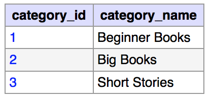
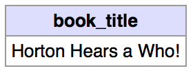
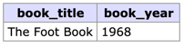
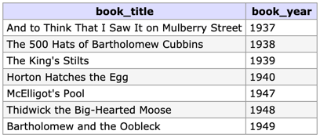
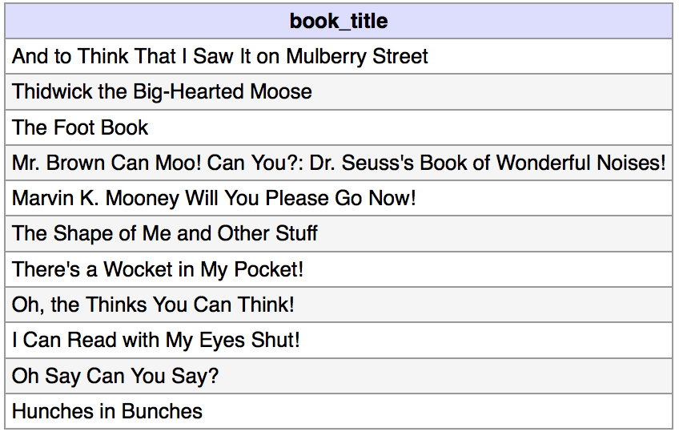
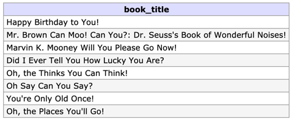
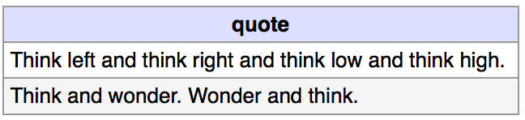
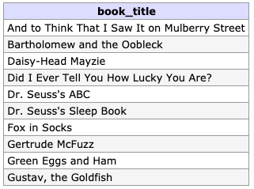
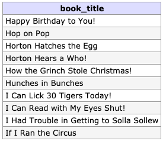
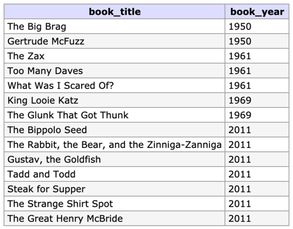

# Seussology DB I

## Objective
For this assignment you will be demonstrating your skills and understanding of SQL Queries by creating queries that read data from the Seussology Database.

## Database
For this assignment you will be using the Seussology Database which is provided with repository as the [Seussology SQL File](seussology.sql).

## Requirements
The following requirement must be met in order to complete the assignment successfully: 

### 1. Clone the Repository
Clone this repository from GitHub and use the provided file to complete the assignment.

### 2. Import the Seussology Database
To import the database, using phpMyAdmin, complete the following instructions.

1. Open phpMyAdmin at [http://phpmyadmin.test](http://phpmyadmin.test)
2. Log into phpMyAdmin using the root username and password
3. From the phpMyAdmin homepage, click on the "Import" tab found at the top of the page.
4. Under the "File to import" section, click the "Choose File" button. Choose the `seussology.sql` file found in this repository.
5. Click the "Go" button found at the bottom of the page. 
6. Once the importing has completed, click on the seussology database which should appear in the list on the left side of page.
7. With the seussology database selected, click on the "SQL" tab at the top of the page. From this page, you can execute custom SQL commands.

### 3. Create SQL Queries
Create **ONE** query for each of the 10 tasks below. The queries should be saved in the `queries.sql` file.

#### 1. Retrieve all columns and rows from the `categories` table.

#### 2. Retrieve the book title (`book_title`) with the book id (`book_id`) of 13 from the `books` table.

#### 3. Retrieve the book title (`book_title`) and book year (`book_year`) from the `books` table with the book title (`book_title`) of "The Foot Book".

#### 4. Retrieve the book title (`book_title`) and book year (`book_year`) from the `books` table with a book year (`book_year`) before 1950.

#### 5. Retrieve all the book titles (`book_title`) from the `books` table with a number of pages (`book_pages`) greater than 35 and less than 56.

#### 6. Retrieve all the book titles (`book_title`) from the `books` table that contain the word "you".

#### 7. Retrieve all the quotes (`quote`) from the `quotes` table that start with the word “Think”.

#### 8. Retrieve the first 10 book titles (`book_title`) from the `books` table when sorted alphabetically.

#### 9. Retrieve the next 10 book titles (`book_title`) from the `books` table when sorted alphabetically.

#### 10. Using a subquery, retrieve all the book titles (`book_title`) and book years (`book_year`) from the `books` table that have the "Short Stories" category.

## Rubric

| Criteria | Grade | Pts|
| ---------| ------| ---|
| Successfully completed task #1 using one query |  | 2 |
| Successfully completed task #2 using one query |  | 2 |
| Successfully completed task #3 using one query |  | 2 |
| Successfully completed task #4 using one query |  | 2 |
| Successfully completed task #5 using one query |  | 2 |
| Successfully completed task #6 using one query |  | 2 |
| Successfully completed task #7 using one query |  | 2 |
| Successfully completed task #8 using one query |  | 2 |
| Successfully completed task #9 using one query |  | 2 |
| Successfully completed task #10 using one query |  | 2 |

## Submission
1. Create a commit with the message "Completed the Seussology DB I Assignment"
2. Push to GitHub
3. Submit the URL to your GitHub Repository in BrightSpace

By making the submission you also agree to the Algonquin College Student Attestation of Academic Integrity below: 

**I hereby declare that the work I submit throughout the duration of this course/program will be my own work.**

**I understand that plagiarism, whether done deliberately or accidentally, is defined as presenting someone else’s work, in whole or in part, as one’s own, and includes the verbal or written submission of another work (for example, ideas, wording, code, graphics, music, and inventions) without crediting that source. This includes all electronic sources (for example, the Internet, television, video, film, and recordings), all print and written sources (for example, books, periodicals, lyrics, government publications, promotional materials, and academic assignments), and all verbal sources (for example, conversations and interviews).**

**I understand that the facilitation of plagiarism, that is, one student sharing his or her work with other students, is also considered an act of plagiarism.**

**I understand that contravening Algonquin College Policy AA 20 - Plagiarism will result in an academic sanction(s) as described in this directive.**